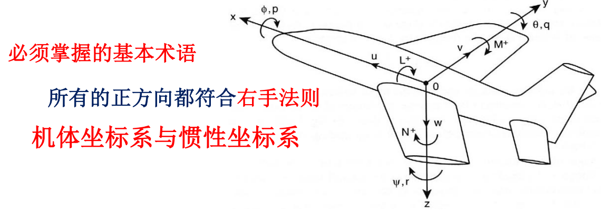

# 第四章 运动方程与稳定性导数估算

## 4.1 引言

在静稳定性分析中假定，在突风等外部干扰和操纵输入等内部干扰的作用下，飞机的运动状态变化很慢，假定飞机是一个静态系统；

而在真实运动中，飞机是一个6自由度的**动态系统**，推导其运动方程，考虑质量与惯性对运动的影响，同时考虑气动阻尼效应，将飞机视为一个刚体，不考虑气动弹性；

Bryan对飞机动稳定性和响应有两个关键假设：

* 作用在飞机上的瞬时气动力和力矩仅与当时瞬时的运动参数有关
* 气动力和力矩随运动参数**线性变化**

**运动方程的建立方法**：

* 建立飞机动力学的数学模型，推导六自由度方程（由于方程耦合且非线性，很难获得解析解）
* 假定飞机受扰动后所有变化均为小量，且飞机具有纵向对称平面，进行解耦，分为纵向和横航向方程
* 利用Bryan的方法，采用泰勒展开来近似力和力矩
* 利用以上所有简化假设，纵向和横航向方程可以用所有运动参数的线性形式表达出来（泰勒展开式中的气动系数就是稳定性与操纵性导数）
* 最后根据飞机外形，利用一些工程方法来计算出这些导数

## 4.2 坐标轴系

## 4.3 运动方程与动轴系的概念

## 4.4 稳定性导数估算

## 4.5 总结

# 第六章 飞机响应与闭环控制

## 6.1 引言

本章研究飞机响应的小扰动方程的解法；

飞机响应取决于**初始状态**和**输入的时间历程**：

* 自由响应：给定初始状态而输入为0；反映系统瞬态特性和动稳定性；
* 强迫响应：零初始状态，给定输入时间历程；反映系统稳态特性；

补充一下体轴系及其相应变量：

| 机体坐标轴 | x          | y          | z          |
| ---------- | ---------- | ---------- | ---------- |
| 力矩       | $L$        | $M$        | $N$        |
| 线速度     | $u$        | $v$        | $w$        |
| 姿态角     | $\phi$     | $\theta$   | $\psi$     |
| 姿态角速度 | $p$        | $q$        | $r$        |
| 操纵面     | $\delta_a$ | $\delta_e$ | $\delta_r$ |
| 转动名称   | roll滚转   | pitch俯仰  | yaw偏航    |

## 6.2 纵向响应

对于飞机的纵向响应：

* 自由响应：给定初始状态下，零输入的解；升降舵保持不变；
* 强迫响应：零初始状态，给定输入时间历程下的解；升降舵按某种方式偏转到一个新的位置后保持不变；

对于**升降舵控制的纵向运动方程**，使用状态空间的形式表达：
$$
\dot{X}=AX+BU
$$
$$
Y=CX+DU
$$

**注意**该方程是基于小扰动和气动力线性化的，不适合复杂的飞机机动运动，需要更精细复杂的动力学模型

其中，
$$
X=
\begin{bmatrix}
x_1\\
x_2\\
x_3\\
x_4\\
\end{bmatrix},\
A=
\begin{bmatrix}
a_{11} & a_{12} & a_{13} & a_{14}\\
a_{21} & a_{22} & a_{23} & a_{24}\\
a_{31} & a_{32} & a_{33} & a_{34}\\
a_{41} & a_{42} & a_{43} & a_{44}\\
\end{bmatrix}, \
B=
\begin{bmatrix}
b_1 \\ b_2 \\ b_3 \\ b_4
\end{bmatrix},\
U = \delta_e
$$
对于$X$状态变量矩阵：相当于扰动
$$
x_1=u,\
x_2=\Delta {\alpha},\
x_3=q,\ 
x_4=\Delta{\theta}
$$

* $u$——速度
* $\Delta{\alpha}$——迎角变化量
* $q$——俯仰角速度
* $\Delta{\theta}$——俯仰角变化量

对于$A$系数矩阵：
$$
\xi_1=\frac{C_{x\dot{\alpha}} c_1}{m_1-C_{z\dot{\alpha}} \cdot c_1},\ 
\xi_2=\frac{C_{m\dot{\alpha}} c_1}{m_1-C_{z\dot{\alpha}} \cdot c_1},\
c_1=\frac{\bar c}{2U_0},\
m_1=\frac{2m}{\rho U_0 S},\
I_{y1}=\frac{I_y}{\frac12 \rho U_0^2 S \bar c}
$$

$$
a_{11}=\frac{C_{xu}+\xi_1 C_{zu}}{m_1},\ 
a_{12}=\frac{C_{x\alpha}+\xi_1 C_{z\alpha}}{m_1},\
a_{13}=\frac{C_{xq}c_1+\xi_1(m_1+C_{zq}c_1)}{m_1},\ 
a_{14}=\frac{C_{x\theta}+\xi_1 C_{z\theta}}{m_1}
$$

$$
a_{21}=\frac{C_{zu}}{m_1-C_{z\dot{\alpha}}c_1},\
a_{22}=\frac{C_{z\alpha}}{m_1-C_{z\dot{\alpha}}c_1},\
a_{23}=\frac{m_1+C_{zq}c_1}{m_1-C_{z\dot{\alpha}}c_1},\
a_{24}=\frac{C_{z\theta}}{m_1-C_{z\dot{\alpha}}c_1}
$$

$$
a_{31}=\frac{C_{mu}+\xi_2C_{zu}}{I_{y1}},\
a_{32}=\frac{C_{m\alpha}+\xi_2C_{z\alpha}}{I_{y1}},\
a_{33}=\frac{C_{mq}c_1+\xi_2(m_1+C_{zq}c_1)}{I_{y1}},\
a_{34}=\frac{\xi_2 C_{z\theta}}{I_{y1}}
$$

$$
a_{41}=0,\ a_{42}=0,\ a_{43}=1,\ a_{44}=0
$$

* $U_0$——x方向的初始速度
* $S$——机翼参考面积
* $C_x$——x方向力系数
* $C_{x\alpha}$——x方向力系数对迎角的偏导数，其余导数类似；需要了解动导数的近似计算
* $\bar c$——平均气动弦长
* $I_y$——俯仰转动惯量

对于$B$矩阵：
$$
b_1=\frac{C_{x\delta_e}+\xi_1C_{z\delta_e}}{m_1},\ 
b_2=\frac{C_{z\delta_e}}{m_1-C_{z\dot{\alpha}}c_1},\
b_3=\frac{C_{m\delta_e}+\xi_2C_{z\delta_e}}{I_{y1}},\
b_4=0
$$

* $C_{x\delta_e}=\partial C_x/\partial \delta_e$
* 注意有的稳定性导数只是为了无量纲化成同样结构，并不是实际偏微分

对部分动力学稳定性与操纵性导数的化简：
$$
C_{xu}=-2C_D-C_{Du},\ C_{x\theta}=-C_L\cos\theta_0,\ C_{x\alpha}=C_L-C_{D\alpha}
$$

$$
C_{zu}=-2C_L-C_{Lu},\ C_{z\theta}= -C_L\sin\theta_0,\ C_{z\alpha}=-C_{L\alpha}-C_D
$$

关于各导数的计算：[MatrixA-1](../images/MatrixA-1.png)（FIXME）；更正版见另一个markdown；

利用MATLAB解得该矩阵的特征值
$$
\lambda_{1,2},\lambda_{3,4}
$$
* 阻尼大，频率高的为短周期
* 阻尼小，频率低的为长周期

对于一个二阶系统的特征方程的标准形式为：
$$
\lambda^2+2\xi \omega_n\lambda+ \omega_n^2=0
$$
令
$$
\lambda = -r \pm js
$$
转化为阻尼比和自然频率的形式：
$$
\xi=\frac{r}{\sqrt{r^2+s^2}}
$$

$$
\omega_n=\sqrt{r^2+s^2}
$$

### 6.2.1 短周期近似

### 6.2.2 长周期近似

### 6.2.3 短周期和长周期模态近似的准确性

### 6.2.4 静态稳定性对纵向响应的影响

### 6.2.5 纵向传递函数

### 6.2.6 纵向频率响应

## 6.3 横航向响应

基于横航向自由度的小扰动假设，可以得到横航向状态空间方程：
$$
\dot{X}=AX+BU
$$

$$
A = \begin{bmatrix}
a_{11} & a_{12} & a_{13} & a_{14} & a_{15}\\
a_{21} & a_{22} & a_{23} & a_{24} & a_{25}\\
a_{31} & a_{32} & a_{33} & a_{34} & a_{35}\\
a_{41} & a_{42} & a_{43} & a_{44} & a_{45}\\
a_{51} & a_{52} & a_{53} & a_{54} & a_{55}\\
\end{bmatrix},\
B = 
\begin{bmatrix}
b_{11} & b_{12}\\
b_{21} & b_{22}\\
b_{31} & b_{32}\\
b_{41} & b_{42}\\
b_{51} & b_{52}\\
\end{bmatrix},\
X=
\begin{bmatrix}
x_1\\x_2\\x_3\\x_4\\x_5
\end{bmatrix}=
\begin{bmatrix}
\Delta \beta\\
\Delta \phi\\
p\\
\Delta \psi\\
r
\end{bmatrix},\
U=
\begin{bmatrix}
\Delta \delta_a\\
\Delta \delta_r
\end{bmatrix}
$$

其中各参数见P489

#### 6.3.1 横航向近似

#### 6.3.2 横航向近似的准确性

#### 6.3.3 横航向传递函数

#### 6.3.4 横航向频率响应

## 6.4 飞行品质

### 6.4.1 纵向飞行品质

### 6.4.2 横航向飞行品质

## 6.5 闭环飞行控制

## 6.6 总结

