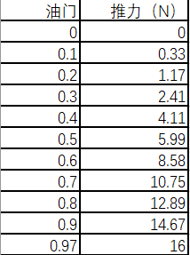

# 飞行品质评估与控制律设计步骤

首先，飞行品质和控制律设计分为两个主要部分：

* 纵向
* 横航向

无论是纵向还是横航向，第一步都是根据飞行速度和海拔等参数，构造相应的状态空间；在这之中，可能会用到插值等方法来补齐缺少的数据，这一点可以参考ZSChen的方法；

根据状态空间各个矩阵的特征值，可以求解长周期短周期模态的阻尼比、自然频率等参数；

根据上面的参数，评定飞行品质；

利用`ss2tf`命令获得传递函数；

根据传递函数，进行各控制律的设计；

## 1. 状态空间矩阵

分为纵向和横航向，分别是$4\times 4$和$5\times 5$的矩阵，加上$4\times 1$和$5\times 2$的矩阵；
$$
\dot{X}=AX+BU
$$

$$
Y=CX+DU
$$

矩阵的相关信息参考[飞机的性能、动力学与稳定性笔记](Airplane_PSDC.md)

### 1.1 纵向状态空间

计算方法参考[动导数和稳定性导数计算方法.md](flight_quality/dynamicDerivative.md)

* 根据指定的飞行速度（12,16,26m/s）获得升力系数；
* 根据升力系数的值查找对应的迎角；
* 根据迎角值，查找阻力系数、俯仰力矩系数等参数（参考老师给的数据--[下载链接](https://gitee.com/hazyparker/learn_control/blob/master/control_law_design/reference/planeParameterWR.pdf)）；
* 可以看出，除阻力系数曲线外，大多曲线均为线性，可以直接取平均值，拟合计算；

是的，**这四行就可以**得到状态空间矩阵的$A$和$B$矩阵了；简易做法参考[设计报告](control_law_design/myDesign.md)；


这一部分如果公式懒得敲可以用这一段：

```matlab
% Temp Parameters
Cxu = -2 * CD;
Cxa = CL - CDa;     % a represents alpha
Cxth = -CL;         % th represents theta
Cxadot = 0;
Cxq = 0;
Czu = -2 * CL;
Cza = -CLa -CD;
Czadot = 0;
Czq = -CLq;
Czth = 0;
Cmu = 0;
m1 = 2 * m / (rho * u * S);
c1 = c / 2 / u;
Iy1 = 2 * Ibyy / (rho * u^2 * S * c);
k1 = Cxadot * c1 / (m1 - Czadot * c1);
k2 = Cmadot * c1 / (m1 - Czadot * c1);

% StateSpace
A = zeros(4, 4);
A(1, 1) = (Cxu + k1 * Czu) / m1;
A(1, 2) = (Cxa + k1 * Cza) / m1;
A(1, 3) = (Cxq + k1 * (m1 + Czq * c1)) / m1;
A(1, 4) = (Cxth + k1 * Czth) / m1;
A(2, 1) = Czu / (m1 - Czadot * c1);
A(2, 2) = Cza / (m1 - Czadot * c1);
A(2, 3) = (m1 + Czq * c1) / (m1 - Czadot * c1);
A(2, 4) = Czth / (m1 - Czadot * c1);
A(3, 1) = (Cmu + k2 * Czu) / Iy1;
A(3, 2) = (Cma + k2 * Cza) / Iy1;
A(3, 3) = (Cmq * c1 + k2 * (m1 + Czq * c1)) / Iy1;
A(3, 4) = 0;
A(4, :) = [0, 0, 1, 0];
A

% ZSChen
```


下面介绍一种MATLAB中的二维插值方法，用于计算B矩阵中的$C_{m\delta_e}$等参数：

> 想法和代码来自：[zschen879](https://gitee.com/zschen879)

升降舵气动效能表格部分如下：


可以看出，$\alpha$和$\delta_e$共同决定了系数的值，因此需要二维插值计算；

首先，需要在MATLAB中用`help`命令查询`interp1`和`interp2`函数的用法和参数的意义；

```matlab
vq = interp1(x,v,xq,method)
```

* `x`：样本点，指定为一行或一列实数向量。`x` 中的值必须各不相同。`x` 的长度必须符合以下要求之一
* `v`：样本值，指定为实数/复数向量、矩阵或数组。如果 v 是矩阵或数组，则每列包含单独的一组一维值
* `xq`：查询点，指定为实数标量、向量、矩阵或数组
* `method`：插值方法，指定为下表中的选项之一

方法如下：

```matlab
ElevaorData = readmatrix('yourFileName.xlsx');
```

* 首先读入一个数据文档，`xlsx`格式，表格第一行默认为表头不用删去；

```matlab
Vq = interp2(X,Y,V,Xq,Yq,method)
```

* 对于二维插值，有一些不同
* XY是样本网络点，V是样本值
* Xq，Yq是查询点

特别地，对于XY：

* 如果 X 和 Y 是矩阵，则包含完整网格（meshgrid 格式）的坐标。使用 meshgrid 函数同时创建 X 和 Y 矩阵。两个矩阵的大小必须相同
* 如果 X 和 Y 是向量，则它们被视为网格向量。这两个向量中的值必须严格单调递增或递减

这里的XY，应该是$\alpha,\delta_e$，满足第二条，向量且单调；但是对于其他变量（查询点），需要同样注意；

```matlab
ele_alpha0 = [-4, 0, 4, 8];
delta_e0 = -20:5:20;
```

* $\alpha$的数据是-4,0,4,8
* $\delta_e$的数据同理

对于查询点`Xq`，`Yq`：

* 注意与XY对应
* 查询点的向量变化更精细，比如`ref_delta_e`可以设置为`-20:0.01:20`
* 在插值操作前，需要对查询点进行`meshgrid`操作，将一维数组（向量）化为二维`meshgrid`形式，以便在三维空间中计算；

```matlab
ele_CL0 = ElevatorData(:, 3);
ele_CL0 = reshape(ele_CL0, legnth(delta_e0), length(ele_alpha0));
```

* 按列分别读取$C_L$，$C_D$，$C_m$参数
* 转化为`length(delta_e0)`行，`legnth(ele_alpha0)`列的矩阵，因为是三维构建，XY坐标对应的Z；

```matlab
[ref_ele_alpha, ref_delta_e] = meshgrid(alpha, ref_delta_e);
```

* `alpha`是当前速度下对应的迎角
* 需要提前把`ref_delta_e`设置好
* 则`ref_ele_alpha`，`ref_delta_e`转换为了`length(ref_delta_e)`行、`length(alpha)`列的二维`meshgrid`数组（尽管在这里是一维的，但是`interp2`操作需要有这么一步）
* 至此，查询点`Xq`、`Yq`构造完成

```matlab
ref_ele_Cm0 = interp2(ele_alpha0, delta_e0, ele_Cm0, ref_ele_alpha, ref_delta_e, 'your chosen method');
```

* 接下来首先对$C_m$进行插值，获得可查询的$C_m$
* `method`可以选择`linear`、`spline`、`pchip`等

```matlab
[min_Cm, pos] = min(abs(ref_ele_Cm0));
```

* 为了找到在$C_m=0$时的$\delta_e$，需要找到在`ref_ele_Cm0`最接近0时，对应的`pos`位置，以便找到在`pos`位置的升降舵偏角

```matlab
delta_e = ref_delta_e(pos);
```

* 根据上面得到的`pos`，进而得到在该位置下，对应的$\delta_e$

```matlab
ref_ele_CL0 = interp2(ele_alpha0, delta_e0, ele_CL0, ref_ele_alpha, ref_delta_e, 'your method');
ref_ele_CD0 = interp2(ele_alpha0, delta_e0, ele_CD0, ref_ele_alpha, ref_delta_e, 'your method');
```

* 对$C_L$，$C_D$也进行插值

```matlab
CL_delta_e0 = (ref_ele_CL0(2:end) - ref_ele_CL0(1:end-1))./(ref_delta_e(2) - ref_delta_e(1));
CD_delta_e0 = (ref_ele_CD0(2:end) - ref_ele_CD0(1:end-1))./(ref_delta_e(2) - ref_delta_e(1));
Cm_delta_e0 = (ref_ele_Cm0(2:end) - ref_ele_Cm0(1:end-1))./(ref_delta_e(2) - ref_delta_e(1));
```

* 求解$C_{L\delta_e}$，$C_{D\delta_e}$，$C_{m\delta_e}$；可以选择应用上面的插值方法，对这三个参数进行插值求解；

```matlab
CL_delta_e = CL_delta_e0(pos);
```

* 然后同样根据`pos`参数，可以找到对应的$C_{L\delta_e}$；
* 其他两个参数同理，根据`pos`参数可以得到；

```matlab
CL_delta_e = interp1(ref_delta_e(2:end), CL_delta_e0, alpha, 'pchip') / trans_rad;
```

* 也可以对插值得到的所有插入的值`Vq`进行一点一点之间的斜率计算，构造出一个新的导数向量（这个方法是**大帅**为了更精细搞的，不用卷了，随便试了一个，误差0.0032，相对误差1.11%，可以忽略）；
* `ref_delta_e(2:end)`作样本点，`CL_delta_e0`作样本值，查询在给定`alpha`下的$C_{L\delta_e}$值；
* `trans_rad`是从角度到弧度的转换量，其值为$\pi/180$，在这里为什么除`trans_rad`，自行思考；
* 这段有bug，**自行注意**

综上，再根据[设计报告](control_law_design/myDesign.md)和[飞机的性能、动力学与稳定性笔记](Airplane_PSDC.md)中的方法，可以得到$B$矩阵；


### 1.2 横航向状态空间

横航向的状态空间矩阵$A$和$B$不列举，见书P489；

如果这一段公式懒得敲，可以用下面这段：

```matlab
% Given Parameters
alpha0 = 2 * trans_rad;
theta0 = 0 * trans_rad;
Cy_dBeta = 0;
Cl_dBeta = 0;
Cn_dBeta = 0;
Cyp = -0.07474;
Clp = -0.51302;
Cnp = -0.09846;
Cyr = 0.38431;
Clr = 0.14807;
Cnr = -0.12997;
Clr = 0.5 * Clr; % fix Clr
Cnr = 1.5 * Cnr; % fix Cnr

% Temp Parameters
b1 = b / (2 * u0);
m1 = 2 * m / (rho * u0 * S);
Ix1 = 2 * Ibxx / (rho * u0^2 * S * b);
Iz1 = 2 * Ibzz / (rho * u0^2 * S * b);
Ixz1 = 2 * Ibxz / (rho * u0^2 * S * b);
Ix2 = Ix1 / (Ix1 * Iz1 - Ixz1^2);
Iz2 = Iz1 / (Ix1 * Iz1 - Ixz1^2);
Ixz2 = Ixz1 / (Ix1 * Iz1 - Ixz1^2);
xi1 = Iz2 * Cl_dBeta + Ixz2 * Cn_dBeta; % 书上写错
xi2 = Ix2 * Cn_dBeta + Ixz2 * Cl_dBeta;

% Matrix A
A = zeros(5, 5);
A(1, 1) = Cy_beta / (m1 - b1 * Cy_dBeta);
A(1, 2) = Cy_phi / (m1 - b1 * Cy_dBeta);
A(1, 3) = Cyp * b1 / (m1 - b1 * Cy_dBeta);
A(1, 4) = 0;
A(1, 5) = -(m1 - b1 * Cyr) / (m1 - b1 * Cy_dBeta);
A(2, :) = [0, 0, 1, 0, 0];
A(3, 1) = Cl_beta * Iz2 + Cn_beta * Ixz2 + xi1 * b1 * A(1, 1);
A(3, 2) = xi1 * b1 * A(1, 2);
A(3, 3) = Clp * b1 * Iz2 + Cnp * Ixz2 * b1 + xi1 * b1 * A(1, 3);
A(3, 4) = 0;
A(3, 5) = Clr * b1 * Iz2 + Cnr * Ixz2 * b1 + xi1 * b1 * A(1, 5);
A(4, :) = [0, 0, 0, 0, 1];
A(5, 1) = Ix2 * Cn_beta + Ixz2 * Cl_beta + b1 * xi2 * A(1, 1);
A(5, 2) = xi2 * b1 * A(1, 2);
A(5, 3) = b1 * (Cnp * Ix2 + Clp * Ixz2 + xi2 * A(1, 3));
A(5, 4) = 0;
A(5, 5) = b1 * (Ix2 * Cnr + Ixz2 * Clr + xi2 * A(1, 5));

% Matrix B
B(2, :) = [0, 0];
B(4, :) = [0, 0];
B(1, 1) = Cy_delta_a / (m1 - b1 * Cy_dBeta);
B(3, 1) = Cl_delta_a * Iz2 + Cn_delta_a * Ixz2 + xi1 * b1 * B(1, 1);
B(5, 1) = Cn_delta_a * Ix2 + Cl_delta_a * Ixz2 + xi2 * b1 * B(1, 1);
B(1, 2) = Cy_delta_r / (m1 - b1 * Cy_dBeta);
B(3, 2) = Cl_delta_r * Iz2 + Cn_delta_r * Ixz2 + xi1 * b1 * B(1, 2);
B(5, 2) = Cn_delta_r * Ix2 + Cl_delta_r * Ixz2 + xi2 * b1 * B(1, 2);
```

* 根据[动导数和稳定性导数计算方法.md](flight_quality/dynamicDerivative.md)中的方法，构造矩阵$A$;
* 矩阵$B$如果要用到二维插值，插值方法和上面一样；


横航向气动特性使用的数据：


可以看到，有`NaN`空值存在；在查表获得$C_{l\beta}$等参数时，无法获得`0`点处的导数值；

* 可以直接按照$\beta=1$处的值近似去算，构造一个`-4:4:4`的`alpha`和三个数的$C_{l\beta}$进行插值，算出不同迎角下的值；
* 但应注意，**如果迎角超出横航向气动特性中给出的范围**，不要在界外插值计算，直接使用该数据表的边界值，见下面的代码

```matlab
if alpha > 4
    alpha = 4; % set limit for alpha
end
if alpha < -4
    alpha = -4;
end
```

另一种方法，可以根据上面大帅的再一个点一个点算一遍斜率，然后取对应迎角下的值；代码和上面的很类似，至于为什么一个`alpha`就能确定，自己探索；

在rudder和aileron的导数计算中，也存在`0`点处导数没有值的情况，应用相同的方法即可插值求解；

>插值代码量有点大，要是不想卷的话直接拿最接近的迎角去用就完事了！！！
>
>插值与否，差别不太大


## 2. 飞行品质

```matlab
lambda = eig(A)
```

即可获得矩阵特征值$\lambda$；

### 2.1 纵向飞行品质

$$
\lambda_{1,2},\lambda_{3,4}
$$
* 阻尼大，频率高的为短周期
* 阻尼小，频率低的为长周期

对于一个二阶系统的特征方程的标准形式为：
$$
\lambda^2+2\xi \omega_n\lambda+ \omega_n^2=0
$$
令
$$
\lambda = -r \pm js
$$
转化为阻尼比和自然频率的形式：
$$
\xi=\frac{r}{\sqrt{r^2+s^2}}
$$

$$
\omega_n=\sqrt{r^2+s^2}
$$

#### 2.1.1 长周期模态飞行品质

根据长周期模态振荡运动的阻尼比确定（由典型二阶系统方程计算得到）

* 等级1：$\xi>0.04$
* 等级2：$\xi>0$
* 等级3：$T_2>55s$

根据上式判断其长周期飞行品质

#### 2.1.2 短周期模态飞行品质

短周期模态需要关注$\xi_{sp,max}$和$\omega^2_{n,sp}/(n/\alpha)$

其中，在迎角线性段内
$$
\frac{n}{\alpha}=(\frac{1}{2W})\rho U_0^2S C_{L\alpha}
$$
故比值$n/\alpha$取决于飞行高度和速度

根据P512表6-2与P513表6-3判断其短周期飞行品质

```matlab
% flight quality
lambda = eigenvalue;
r_lp = abs(real(lambda(1)));
s_lp = abs(imag(lambda(1)));
r_sp = abs(real(lambda(3)));
s_sp = abs(imag(lambda(3)));

xi_lp = r_lp / sqrt(r_lp^2 + s_lp^2);
omega_lp = sqrt(r_lp^2 + s_lp^2);
xi_sp = r_sp / sqrt(r_sp^2 + s_sp^2);
omega_sp = sqrt(r_sp^2 + s_sp^2);

n = ???;
n_divide_alpha = 0.5 * rho * u^2 * S * CLa / W;
CAP = omega_sp^2 / n_divide_alpha;

ta = 0.6931 / abs(r_lp);

disp('xi_sp,min'), disp(num2str(xi_lp));
disp('CAP'), disp(num2str(CAP));
disp('ta'), disp(num2str(ta));
```

### 2.2 横航向飞行品质

从滚转模态、荷兰滚模态和螺旋模态三个方面进行评估，见P491对特征值的分类；

#### 2.2.1 滚转收敛模态

滚转收敛模态需要根据时间常数的最大允许值判断；

书上P494式6-209给出了滚转收敛模态近似时间常数的计算方法：
$$
\tau=-\frac{I_{x1}}{C_{lp}b_1}
$$
在二阶系统中，时间常数是无阻尼自然频率$\omega_n$的倒数，也可以算得其时间常数；

#### 2.2.2 荷兰滚模态

对于荷兰滚模态，有：
$$
\xi \omega_n = r
$$

$$
\omega_n\sqrt{1-\xi^2}=s
$$

$$
T=\frac{2\pi}{\omega_n\sqrt{1-\xi^2}}
$$

$$
t_a = \frac{0.69}{\xi \omega_n}
$$

根据书上P513表6-5比较得出其荷兰滚模态飞行品质

#### 2.2.3 螺旋模态

螺旋模态的飞行品质由最小倍幅时间决定；

最小倍幅时间仍然采用书上P468式6-40
$$
t_a=\frac{0.6931}{|r|}
$$

```matlab
% flight quality
lambda_roll = lambda(5);
lambda_spiral = lambda(2);
lambda_dutch = lambda(3);

tau_roll = -Ix1 / Clp / b1;
tau_roll1 = 1 / abs(real(lambda_roll));

r_dutch = abs(real(lambda_dutch));
s_dutch = abs(imag(lambda_dutch));
xi_dutch = r_dutch / sqrt(r_dutch^2 + s_dutch^2);
omega_n_dutch = sqrt(r_dutch^2 + s_dutch^2);
xi_omega_dutch = xi_dutch * omega_n_dutch;

ta_spiral = 0.6931 / abs(real(lambda_spiral));

disp('A='), disp(A);
disp('B='), disp(B);

disp('lambda:'), disp(lambda);

disp('roll: Time constant='), disp(tau_roll);

disp('dutch roll:')
dutch_info = ['damp=', num2str(xi_dutch), ', damp*omega=', num2str(xi_omega_dutch), ', omega=', num2str(omega_n_dutch)];
disp(dutch_info);
disp(' ');

disp('spiral: double time='), disp(ta_spiral);
```


## 3. 传递函数

```matlab
C = eye(4);
D = zeros(4, 1);
[num, den] = ss2tf(A, B, C, D);
```

对于纵向响应，C，D矩阵如上，使用`ss2tf`获得传递函数分子矩阵与分母矩阵；

注意$x_1,x_2,x_3,x_4$的实际意义，比如$x_3$代表$q$，则可以获得该传递函数为：

```matlab
Gs_q = tf(num(3, :), den);
```

也可以使用元胞来查看所有传递函数：

```matlab
Gs = tf(mat2cell(num, [1, 1, 1, 1], 5), den); % 4+1=5
```

至此，总的示例代码如下：

[Code Demo](control_law_design/sources/CodeDemo.md)

## 4. 控制律设计

首先放上老师给的MATLAB文件，由于我用的Fira Code字体解码不出来汉字（也有可能是UTF8不行，VSCode改成GB2312或者GBK就行了）

```matlab
% 控制律设计
% 每一节对应一个回路
% 配合"hand_linear_analyse.slx"使用
% 在该slx文件中，要把传函的分子分母和状态空间的ABCD矩阵换成自己的动力学模型

%% 传递函数设计q回路

% 从升降舵到q的传函的参考值：
% UAV.linear.q_sp_de.transfer = 
%      -33.9 s - 173.8
%   ---------------------
%   s^2 + 10.62 s + 79.51

sisotool(UAV.linear.q_sp_de.transfer);  

% q_controller = tf([0.5,0.2],[1,0]);	% q_controller(s) = 0.5+0.2/s = Kq*(1+0.4/s); % Kq = 0.5, KqI = 0.2

%% 传递函数设计俯仰角theta回路
% 输入in为qc，输出为theta
q_controller= 0.5;  % q回路的设计结果
tf_de2theta = tf(1,[1,0])*feedback(UAV.linear.q_sp_de.transfer * q_controller, -1);
sisotool(tf_de2theta);

%% 4阶完整纵向小扰动方程优化设计控制律
% 在Control law design框中
% 断开 Ktheta,输入为thetac，输出为theta
[num_theta,den_theta]=linmod('hand_linear_analyse');
tf_theta_loop = tf(num_theta,den_theta);
tf_theta_loop = minreal(tf_theta_loop);
sisotool(tf_theta_loop);

%% 横航向
%% 偏航角速度r
% 从方向舵到r的传函的参考值：
% UAV.linear.r_dutch_dr.transfer = 
%     -2.877 s + 1.277
%   ---------------------
%   s^2 + 2.468 s + 27.99
  
tf_dr2r = UAV.linear.r_dutch_dr.transfer;
sisotool(tf_dr2r); 

%% 滚转角速度p

% 从副翼舵到p的传函的参考值：
% UAV.linear.lateral_roll = 
%    -21.65
%   ---------
%   s + 17.54
  
sisotool(UAV.linear.lateral_roll); 

%% 滚转角phi
p_controller= 0.8;  % p回路的设计结果
tf_da2phi = tf(1,[1,0])*feedback(UAV.linear.lateral_roll * p_controller, -1);
sisotool(tf_da2phi);

%% 4阶完整横航向小扰动方程优化设计控制律
% 在Control law design框中
% 断开 Kphi,输入为phic，输出为phi
[num_phi,den_phi]=linmod('hand_linear_analyse');
tf_phi_loop = tf(num_phi,den_phi);
tf_phi_loop = minreal(tf_phi_loop);
sisotool(tf_phi_loop);
```

### 4.1 纵向控制律

#### 4.1.1 设计俯仰角速度控制回路

首先需要根据短周期模态的简化计算公式，得到升降舵到俯仰角速度的传递函数：

短周期是高频率、大阻尼的振荡运动，可以假设在这一过程中$u=\dot{u}=0$，忽略x方向的力方程，可以得到3阶简化状态空间；

对于定直平飞，可以进一步简化为2阶状态空间；

短周期近似传递函数如下：
$$
\begin{bmatrix}
\dot{x_1}\\ \dot{x_2}
\end{bmatrix}=
\begin{bmatrix}
a_{11}&a_{12}\\a_{21}&a_{22}
\end{bmatrix}
\begin{bmatrix}
x_1\\ x_2
\end{bmatrix}+
\begin{bmatrix}
b_1\\b_2
\end{bmatrix}
\Delta \delta_e
$$
参数的值见书P470；

由此可以进行单输入单输出系统的分析，代码如下：

```matlab
A_short = zeros(2, 2);
B_short = zeros(2, 1);
As = A_short;
Bs = B_short;
As(1, 1) = Cza / (m1 - Czadot * c1);
As(1, 2) = (m1 + Czq * c1) / (m1 - Czadot * c1);
As(2, 1) = (1 / Iy1) * (Cma + Cmadot * c1 * Cza / (m1 - Czadot * c1));
As(2, 2) = (1 / Iy1) * (Cmq * c1 + (m1 + c1 * Czq) * c1 * Cmadot / (m1 - Czadot * c1));
Bs(1, 1) = Czde / (m1 - Czadot * c1);
Bs(2, 1) = (1 / Iy1) * (Cmde + Cmadot * c1 * Czde / (m1 - Czadot * c1));
Cs = eye(2);
Ds = zeros(2, 1);
[num_s, den_s] = ss2tf(As, Bs, Cs, Ds);
Gs_short = tf(mat2cell(num_s, [1, 1], 3), den_s);

% get q_sq_de.transfer
UAV.linear.q_sp_de.transfer = Gs_short(2);

% use sisotool(single inout and output analysis)
sisotool(UAV.linear.q_sp_de.transfer);
```

至此，开始`SISO`的分析；下载老师的PPT--[reference/designSteps.pdf](https://gitee.com/hazyparker/learn_control/blob/master/control_law_design/reference/designSteps.pdf)；


图中，`P.M.`为相位裕度，其下是截止频率

* `Edit Architecture`中将`loop signs`设置为`+`
* 选择`Controllers and Fixed Blocks`为`C`
* 拖拽根轨迹图中的极点位置，或`Tuning methods`-`PID Tuning`

该拖拽极点到一个怎样的位置，或者PID控制的P比例控制，这个常数应该给到多少是合适的，或者说，怎样算是一个好的P控制，好的控制回路的**性能指标**是什么？（自控基础薄弱）

* 相位裕度：相位裕度一般在这里取100以上（AQJ），之后的外回路设计会降低相位裕度；一般要求角速度的相角裕度大于90度（PPT）
* 调节时间：一般角速度的调节时间为0.5~2秒左右（PPT）；
* 截止频率：2~20rad
* 阻尼比：一级飞行品质短周期阻尼为$[0.35,1.3]$，调节时注意看右下角damp，基本都是满足的


最终，得到一个C的值，也就是比例控制中常数的值`q_controller`

`q_controller`即为`Kq`


#### 4.1.2 设计俯仰角控制回路

```matlab
% get q_controller
q_controller = 'your q_controller value';

% get theta_sp_de.transfer
tf_de2theta = tf(1, [1, 0]) * feedback(UAV.linear.q_sp_de.transfer * q_controller, -1);

% analyse de2th loop
% using de2q as inner loop
sisotool(tf_de2theta);
```

进而开始外回路的设计；在内回路引入积分控制之前，内外回路都是简单的P比例控制；


* `Edit Architecture`中将`loop signs`设置为`+`
* 选择`Controllers and Fixed Blocks`为`C`

同理，注意之前提到的对俯仰角回路的性能指标要求，进行设计；


最终得到`Ktheta`的设计值；

#### 4.1.3 四阶状态空间仿真验证

把`q`和`theta`控制回路放入四阶状态空间，仿真验证；

需要在此加入油门的矩阵参数；可以看出在`hand_linear_analyse.slx`中，B矩阵有两列，第二列即为油门参数；

根据水平方向的动力学方程求解：
$$
T=D
$$

$$
D = \frac12\rho V^2 S C_D
$$

在这两个方程中，$C_D$是之前已经算好给定的，因此可以求出推力的值；



根据上表，计算对应的推力下，油门-推力曲线的斜率，为`Tdp`

油门引入之后，更新状态空间矩阵，代码如下：

```matlab
% Entire 4 order system
B = [B, zeros(4, 1)];
B(1, 2) = Tdp * cos(alpha * trans_rad) / m;
B(2, 2) = -Tdp * sin(alpha * trans_rad) / m / u; % trans_rad = pi / 180
B(3, 2) = B(2, 2) * Cmadot * (c / 2 / u) * 0.5 * rho * u^2 * S * c / Ibyy;
D = [D, zeros(4, 1)];
```

之后可以把老师给的`simulink`里面纵向控制的框图单独复制出来，进行四阶仿真；

一般是存在稳态误差的，可以使用积分控制消除；


#### 4.1.3 四阶状态空间迭代优化

在内回路中引入积分控制，不断迭代优化，得到合适的结果；

其实老师图里给的数就差不多；


### 4.2 横航向控制律

#### 4.2.1 设计偏航角速度控制回路

即设计偏航阻尼器；需要获得从方向舵到偏航角速度的传递函数；

需要计算荷兰滚模态的传递函数；见书P495式6-214；
$$
\begin{bmatrix}
\Delta \dot{\beta}\\
\dot{r}
\end{bmatrix}=
\begin{bmatrix}
a_{11}&a_{12}\\
a_{21}&a_{22}\\
\end{bmatrix}
\begin{bmatrix}
\Delta\beta\\
r
\end{bmatrix}+
\begin{bmatrix}
b_{11}&b_{12}\\
b_{21}&b_{22}\\
\end{bmatrix}
\begin{bmatrix}
\Delta \delta_a\\
\Delta \delta_r
\end{bmatrix}
$$
如果要获得以$\Delta\delta_r$输入的传递函数，可以作如下处理：
$$
\begin{bmatrix}
\Delta \dot{\beta}\\
\dot{r}
\end{bmatrix}=
\begin{bmatrix}
a_{11}&a_{12}\\
a_{21}&a_{22}\\
\end{bmatrix}
\begin{bmatrix}
\Delta\beta\\
r
\end{bmatrix}+
\begin{bmatrix}
b_{12}\\b_{22}
\end{bmatrix}
\Delta \delta_r
$$
则可以获得`r_dutch_dr`传递函数

注意，书上P496的$b_{21},b_{22}$少除了一个$I_{z1}$；

参考代码如下：

```matlab
% UAV.linear.r_dutch_dr.transfer
A_dutch = zeros(2, 2);
A_dutch(1, 1) = Cy_beta / (m1 - Cy_dBeta * b1);
A_dutch(1, 2) = - (m1 - b1 * Cyr) / (m1 - b1 * Cy_dBeta);
A_dutch(2, 1) = (1 / Iz1) * (Cn_beta + (Cn_dBeta * b1 * Cy_beta) / (m1 - b1 * Cy_dBeta));
A_dutch(2, 2) = (1 / Iz1) * (b1 * Cnr + (-Cn_dBeta * b1 * (m1 - b1 * Cyr)) / (m1 - Cy_dBeta * b1));
B_dutch_dr = zeros(2, 1);
B_dutch_dr(1, 1) = Cy_delta_r / (m1 - Cy_dBeta * b1);
B_dutch_dr(2, 1) = Cn_delta_r + Cn_dBeta * b1 * Cy_delta_r / (m1 - Cy_dBeta * b1);
B_dutch_dr(2, 1) = B_dutch_dr(2, 1) / Iz1;
C_dutch = eye(2);
D_dutch_dr = zeros(2, 1);
```

然后使用`ss2tf`获得传递函数；

进行控制律设计，使用P比例控制

```matlab
% read formal workspace data
HorizontalAnalysis;

% get r_dutch_dr transfer
G_dr2r = Gr_dutch_dr;

% get delta_rudder_to_r, dr2r.transfer
% using name UAV.linear.r_dutch_dr.transfer
sisotool(G_dr2r);
```

主要就是一句`sisotool`，设计方法和之前的比例控制回路一样；

最后得到比例系数`Kr`；

#### 4.2.2 设计滚转角速度控制回路

根据书上P506式6-266,267
$$
\frac{p(s)}{\Delta \delta_a(s)}=\frac{C_{l\delta_a}}{I_{x1}s-C_{lp}b_1}
$$
得到由副翼舵面偏角到滚转角速度`p`的传递函数；
$$
G_{da2p}=\frac{C_{l\delta_a}/I_{x1}}{s-C_{lp}b_1/I_{x1}}
$$

```matlab
sisotool(UAV.linear.lateral_roll); 
```

分析方法相同，略；

#### 4.2.3 设计滚转角控制回路

分析方法相同，略；

#### 4.2.4 四阶状态空间迭代优化

 注意是四阶空间；

删去了$\psi$的行和列；

```matlab
% refine matrix A,B,C,D
A_4order = A; % back up matrix A
B_4order = B;
C_4order = eye(4);
D_4order = zeros(4, 2);
A_4order(4, :) = [];
A_4order(:, 4) = [];
B_4order(4, :) = [];
```

并且要注意`simulink`里面的输出顺序，与原始的A，B矩阵输出顺序不同；此时有两个选择，调整`SimuLink`中的输出顺序或者调整`MATLAB`中矩阵的行列顺序；

删去$\psi$之后，输出顺序为$\beta, \phi, p, r$，`SimuLink`输出顺序为$\beta, p, r, \phi$；

行变化矩阵：

```matlab
row_trans = [1 3 4 2];
```

列变化矩阵：

```matlab
col_trans = [1; 3; 4; 2];
```

对A，B矩阵行列顺序进行调整：

```matlab
A_4order = A_4order(row_trans, :);
A_4order = A_4order(:, col_trans);
B_4order = B_4order(row_trans, :);
```


