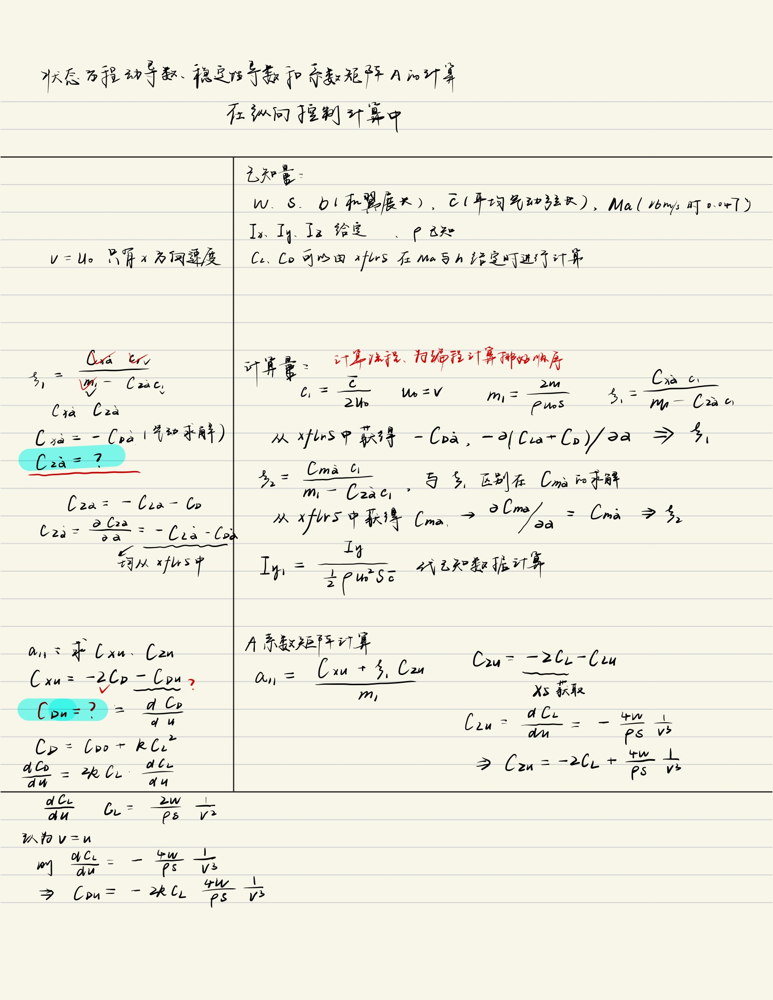
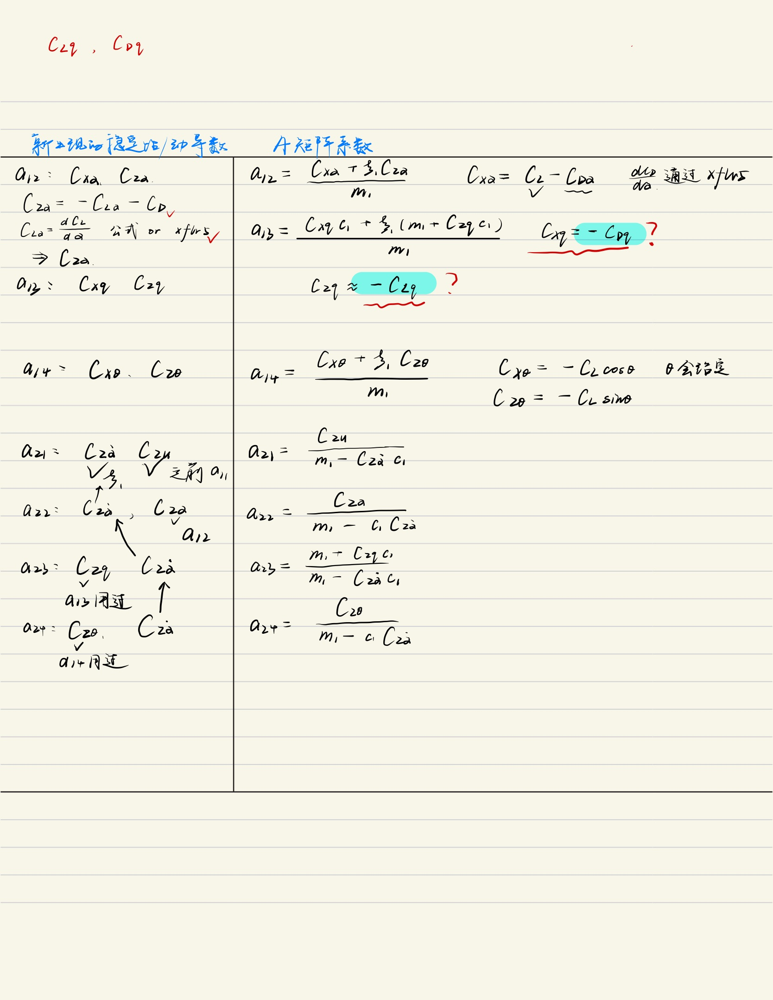
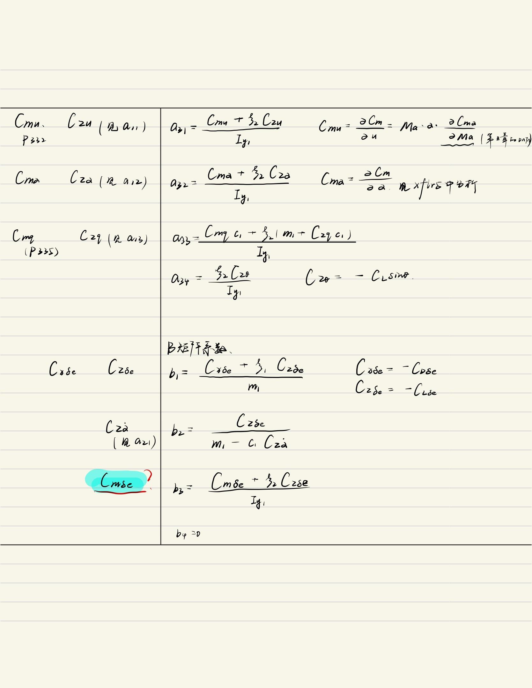
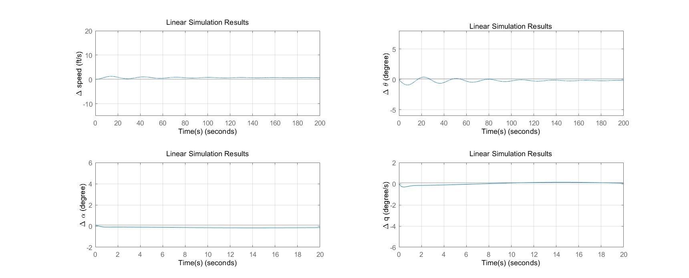

《飞行动力学与飞行控制》分四个部分，内容见二级标题

## 1. 飞行动力学

飞控设计的三个阶段：

* 从总体设计、空气动力学到飞行动力学
* 飞行动力学+飞行控制到飞行仿真
* 飞行仿真到实际飞行

需要考虑的误差修正：

* 状态误差：外形、重量、重心等
* 计算、实验误差：模型简化、方法的局限性等

飞行控制设计完成后，需要进行主要参数的拉偏实验，验证飞行控制的鲁棒性


## 2. 飞行品质计算与分析

飞行品质的计算作用在于，量化飞行员在给定的飞行阶段操纵飞机完成任务的难易程度

### 2.1 主要步骤

* 原始数据
* 6DOF飞行动力学方程
* 求解平衡飞行状态
* 在平衡飞行状态小扰动线性化
* 纵向、横航向四阶小扰动方程
* 模态特性
* 飞行品质评估

飞行品质分为三个等级，ABC三个阶段

### 2.2 纵向飞行品质

首先需要建立升降舵控制的纵向运动方程，方法见P462-P464；

关于矩阵A，B的计算，我的手稿：（其中有很多错误，在这里留做纪念）







**导数的计算**有一些过程存在问题；

* 有的导数计算很麻烦，书上写了很多估算办法，但对于大展弦比，很多导数接近0
* 有的可能要从XFLR5中获取，不确定

**动导数的计算是重中之重！**但有好多近似和忽略的，因为是小扰动+线性假设，因此大大简化了计算

动导数的计算，详细步骤见[动力学稳定性与操纵性导数分析与计算](../flight_quality/dynamicDerivative.md)


总结下来，只需要判断$C_L,C_D,C_{L\alpha},C_{D\alpha},C_{mu},C_{m\alpha}$六个量就可以构成状态矩阵A；

由于飞机重量和速度给定，在小迎角的情况下有
$$
\frac12\rho v^2SC_L=W
$$
分别计算在$12m/s,16m/s,26m/s$的速度下，升力系数的值，从而得到其对应的迎角，找到其阻力系数及其他值

* $12m/s,C_L=1.0040,\alpha=7^{\circ}$
* $16m/s,C_L=0.5648,\alpha=2^{\circ}$
* $26m/s,C_L=0.2139,\alpha=-2^{\circ}$
* **可以用一些更精细的插值，我在这里主要是想直接用老师给的数据文档，实际12m/s时的迎角近似为5.9degree（来自ZSChen）**

可以得到其他系数的值，并且做需要的运算；

得到矩阵A的特征值，存在一些问题

  -4.6448 + 0.0000i
  -0.0763 + 0.8559i
  -0.0763 - 0.8559i
  -0.2310 + 0.0000i

很显然不符合长短周期特征值的常识，试着去DEBUG；

 **单位，弧度制还是角度制**：在升力线斜率和阻力线斜率的计算（任何涉及角度的计算）中都必须考虑的问题，弧度是标准单位，书上也说所有的单位均为弧度制；

> 对比书上通航飞机的纵向响应矩阵和我们得到的纵向响应矩阵，可以看到有些量存在较大的差别；但由于飞机本身尺寸重量差距很大，因此不确定问题


试着用一下书上P467的例子做一个响应，但是结果和书上的差距比较大

* 源码——[use_lsim](../flight_quality/use_lsim.m)
* 结果——[image](../images/example467.jpg)



* 注意单位是角度还是弧度
* 书上的图用的矩阵可能不是之前给的矩阵


假设动导数计算正常，矩阵A特征值正常，下一步进行飞行品质的评定：

 #### 2.2.1 长周期模态

根据长周期模态振荡运动的阻尼比确定（由典型二阶系统方程计算得到）

* 等级1：$\xi>0.04$
* 等级2：$\xi>0$
* 等级3：$T_2>55s$

根据上式判断其长周期飞行品质

#### 2.2.2 短周期模态

短周期模态需要关注$\xi_{sp,max}$和$\omega^2_{n,sp}/(n/\alpha)$

其中，在迎角线性段内
$$
\frac{n}{\alpha}=(\frac{1}{2W})\rho U_0^2S C_{L\alpha}
$$
故比值$n/\alpha$取决于飞行高度和速度

根据P512表6-2与P513表6-3判断其短周期飞行品质

### 2.3 横航向飞行品质

与纵向飞行品质计算过程类似，见P489式6-185至6-187；

* 在对应速度的迎角，0侧滑角下分析A矩阵；根据已知数据可以得到，$C_y,C_l,C_n=0$，但$C_{y\beta}$等不为0；

完成矩阵中各个气动参数的计算，得到矩阵特征值；

从滚转模态、荷兰滚模态和螺旋模态三个方面进行评估，见P491对特征值的分类：

特别地，对于荷兰滚模态，有：
$$
\xi \omega_n = r
$$

$$
\omega_n\sqrt{1-\xi^2}=s
$$

$$
T=\frac{2\pi}{\omega_n\sqrt{1-\xi^2}}
$$

$$
t_a = \frac{0.69}{\xi \omega_n}
$$

对比表6-4至表6-6，得出其横航向的飞行品质

至此，飞行品质结束


## 3. 飞行控制律设计与数字飞行仿真

### 3.1 纵向控制律设计

#### 3.1.1 俯仰角速度回路

首先需要根据短周期模态的简化计算公式，得到升降舵到俯仰角速度的传递函数：

短周期是高频率、大阻尼的振荡运动，可以假设在这一过程中$u=\dot{u}=0$，忽略x方向的力方程，可以得到3阶简化状态空间；

对于定直平飞，可以进一步简化为2阶状态空间
$$
\begin{bmatrix}
\dot{x_1}\\ \dot{x_2}
\end{bmatrix}=
\begin{bmatrix}
a_{11}&a_{12}\\a_{21}&a_{22}
\end{bmatrix}
\begin{bmatrix}
x_1\\ x_2
\end{bmatrix}+
\begin{bmatrix}
b_1\\b_2
\end{bmatrix}
\Delta \delta_e
$$
其中的系数与纵向状态空间A矩阵系数有部分相同或相似；见P470；

由此式，计算**升降舵到俯仰角速度的传递函数**

其中，$x_1=\Delta\alpha$，$x_2=q$；

首先根据状态方程到传递函数的转换公式：
$$
G(s)=C(sI-A)^{-1}B+D
$$
所以需要补全$C,D$矩阵，则为：

```matlab
C = eye(4);
D = zeros(4, 1);
```

查找MATLAB中相应的状态方程到传递函数的方法：`ss2tf(A, B, C, D)`

再用`tf`获得具体的传递函数；

可以得到短周期近似的传递函数`Gs_sp`；

**SISO**分析中，需要依据什么设计？

* 相位裕度
* 响应时间

#### 3.1.2 俯仰角回路

同理

#### 3.1.3 四阶仿真验证

`q`，`theta`怎么直接仿真验证？

怎么把回路放到状态空间？

* 现在算是设计好了整个$\theta$回路了，但是不带积分
* 要注意角度和弧度的转换
* 或许是一些`lsim`，`step`这样的函数；这就要求，写出传递函数，然后代到函数中去用；
* 或许是`Simulink`中设计框图实现的？


### 3.2 横向控制律设计

## 4. 飞行控制系统的实现与半物理仿真

