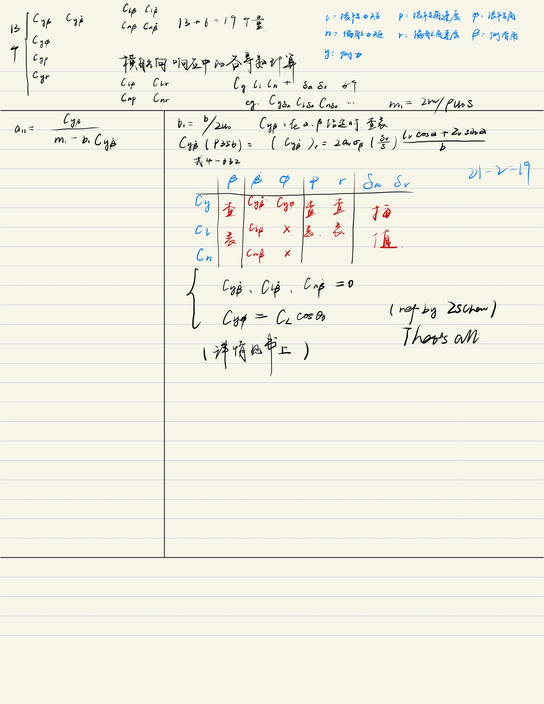

# 动力学稳定性与操纵性导数与相关系数计算

加速度导数和动导数都称为动力学稳定性与操纵性导数（P320）；

包含时间项的稳定性导数写成该形式是为了方便无量纲化；

## 1. 纵向

### 1.1 加速度导数

#### 1.1.1 $C_{x\dot{\alpha}}$

P324，式4-455
$$
C_{x\dot{\alpha}} \approx -C_{D\dot{\alpha}}
$$

P324式4-458下一句话，$C_{D\dot{\alpha}}$较小，可以忽略不计，故在此暂取0

#### 1.1.2 $C_{z\dot{\alpha}}$

P324，式4-457
$$
C_{z\dot{\alpha}} \approx -C_{L\dot{\alpha}}
$$

P319，式4-407
$$
C_{L\dot{\alpha}}=\cfrac{\partial C_L}{\partial (\cfrac{\dot{\alpha}\bar{c}}{2U_0})}
$$

在小迎角，小扰动下认为升力线斜率$C_{L\alpha}$不变，即$C_{z \dot{\alpha}}=0$

#### 1.1.3 $C_{m\dot{\alpha}}$

给定，$C_{m \dot{\alpha}}=0.3C_{mq}$

### 1.2 动导数

#### 1.2.1 $C_{mq}$

给定，$C_{mq}=-16.76863$

#### 1.2.2 $C_{zq}$

P324，式4-458
$$
C_{zq} \approx -C_{Lq}
$$

$C_{Lq}$的计算见P332，章节4.4.1.2（1）

给定为$C_{Lq}=10.06864$

#### 1.2.3 $C_{xq}$

$$
C_{xq} \approx -C_{Dq}
$$

$C_{Dq}$可以忽略，因此取0

### 1.3 稳定性导数

#### 1.3.1 $C_{xu}$

P323，式4-432
$$
C_{xu}=-2C_D-C_{Du}
$$

关于$C_{Du}$，书上P331式4-480，在低亚声速时该值取0

则有：
$$
C_{xu}=-2C_D
$$

#### 1.3.2 $C_{zu}$

P323，式4-439
$$
C_{zu}=-2C_L-C_{Lu}
$$

关于$C_{Lu}$，见书上P331式4-481，在低亚声速时该值取0

#### 1.3.3 $C_{mu}$

P332，式4-482
$$
C_{mu}=\frac{\partial C_m}{\partial u}=Ma\times \alpha\times \frac{\partial C_{m\alpha}}{\partial Ma}
$$

#### 1.3.4 $C_{x\theta}$

P323，式4-434
$$
C_{x\theta}=-C_L\cos{\theta_0}
$$

#### 1.3.5 $C_{z\theta}$

P323，式4-440
$$
C_{z\theta}=-C_L\sin{\theta_0}
$$

$\theta_0$为初始状态下的俯仰角

#### 1.3.6 $C_{z\alpha}$

P324，式4-454
$$
C_{z\alpha}=-C_{L\alpha}-C_D
$$

默认线性，升力线斜率不发生改变

#### 1.3.7 $C_{x\alpha}$

P324，式4-447
$$
C_{x\alpha}=C_L-C_{D\alpha}
$$

默认线性，阻力线斜率不发生改变

#### 1.3.8 $C_{m\alpha}$

$C_{m\alpha}=dC_m/d\alpha$，$C_m=M/qS\bar{c}$

认为线性，根据气动数据计算

### 1.4 有关B矩阵的导数计算

三个，$C_{x\delta_e}$,$C_{z\delta_e}$,$C_{m\delta_e}$

平飞情况下，俯仰力矩系数$C_m=0$；在各个速度下，可以求得各迎角的值，查找在该迎角下使得$C_m=0$的舵偏角$\delta_e$，即可根据表中数据插值查出三个导数的值；（ref by ZSChen）

参考书上P467例子，有：
$$
C_{x\delta_e}=-C_{D\delta_e}
$$

$$
C_{z\delta_e}=-C_{L\delta_e}
$$

说是第四章有，但我没找到；

$C_{m\delta_e}$就还是插值求；

## 2. 横向

参考：

**FIXME:**纵向的也可以这样列表求解，找参数（有空可以refine）
